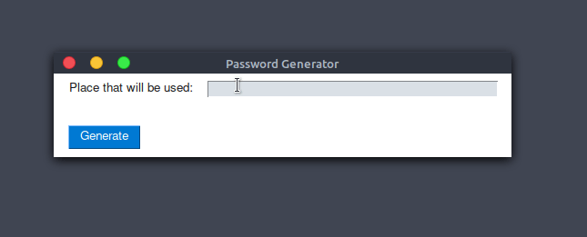

<h1 align="center">
  Password Generator
   
</h1>

<h4 align="center">A simple Password Generator built in Python</h4>

  <a href="#key-features">Key Features</a> •
  <a href="#how-to-use">How To Use</a> •
  <a href="#download">Download</a> •
  <a href="#credits">Credits</a> •
  <a href="#related">Related</a> •
  <a href="#license">License</a>

## Key Features

- Security
  - Generates a password with a length between 8 and 16, with letters, numbers and symbols
- Cross platform
  - Windows and Linux ready.

## How To Use

To run this app just download the latest release and execute.

Or you can clone the repository and execute as a python program, you will need python and pysimplegui installed on computer.

## Download

You can [download](https://github.com/ryuvi/Password-Generator/releases/tag/1.0.0) the latest stable version of Markdownify for Windows, macOS and Linux.

## Credits

This software uses the following open source packages:

- [Python](https://www.python.org/)
- [PySimpleGUI](https://pysimplegui.readthedocs.io/en/latest/)

## License

[MIT](https://github.com/ryuvi/Password-Generator/blob/main/LICENSE)
